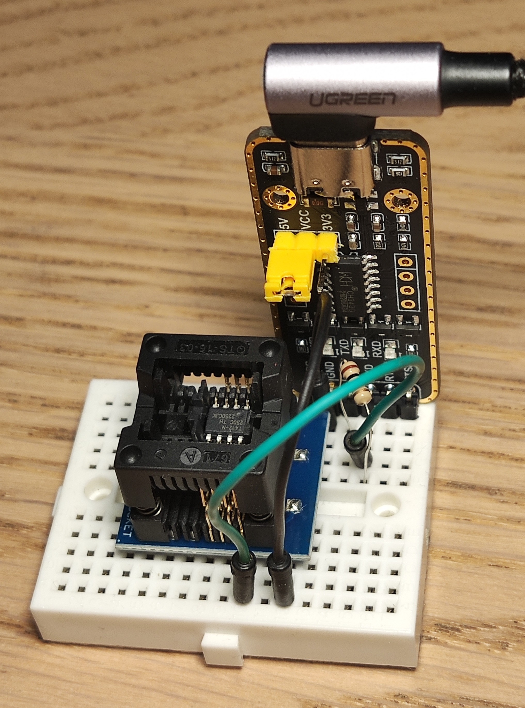

# Programing ATtiny412
## Hardware
ATtiny412 use completly different (UDPI) programing interface than older type of AVR microcontroller. You can program UDPI You will need some UART interface - preferably USB-Uart. I use a Waveshare 21443 with USB-C and changable power (3V3 or 5V), but any other shall work. Additionaly You will need a 1kohm resistor (1/8 watt well be ok, but of course You can use bigger one).
  
Real connection on bredboard  might look like below. ATtiny412 (and other uc in this series) don't have a convinient Dip package, so SOP8 to Dip8 adapter was used.  


## Software
### Toolchain
You need gcc-avr it is very popular, probably Your's distro have one.  
For some reasons, "newer" (about 10 years?) microcontrollers needs additionally atpack, with many data about them.  
For ATtiny412 You need  "Atmel ATtiny Series Device Support" from [here](http://packs.download.atmel.com/).
Unpack it somewhere (/opt in our examples) and give the path in command line, or include it in [makefile](/doc/makefile.md)
### Programmer
#### Linux
install pymcuprog, preferably in venv enviroment.
check dmesg for info about addresses
```console
sudo dmesg
```
something like below shall be found
```console
[52572.355445] usb 1-1: new full-speed USB device number 21 using xhci_hcd
[52572.505488] usb 1-1: New USB device found, idVendor=1a86, idProduct=55d3, bcdDevice= 4.43
[52572.505503] usb 1-1: New USB device strings: Mfr=0, Product=2, SerialNumber=3
[52572.505509] usb 1-1: Product: USB Single Serial
[52572.505514] usb 1-1: SerialNumber: 5434037781
[52572.571752] cdc_acm 1-1:1.0: ttyACM0: USB ACM device
[52572.571793] usbcore: registered new interface driver cdc_acm
[52572.571796] cdc_acm: USB Abstract Control Model driver for USB modems and ISDN adapters
```
which mean that addres is **ttyACM0**

to check connection type (wiht correct uart address):
```console
pymcuprog ping -t uart -u /dev/ttyACM0 -d attiny412
```

proper answer will be similar to:
```console
Connecting to SerialUPDI
Pinging device...
Ping response: 1E9223
Done.
```
If You see something similar You are ready to go.

To erase memory and send program to microcontroller You can use:
```console
pymcuprog erase -t uart -u /dev/ttyACM0 -d attiny412
pymcuprog write -f program.hex -t uart -u /dev/ttyACM0 -d attiny412
```

Getting .hex file from source code and sending it to microcontroller is automated in makefile.


## Makefile
rest of the programming process is automated using Makefiles (TODO: link)


