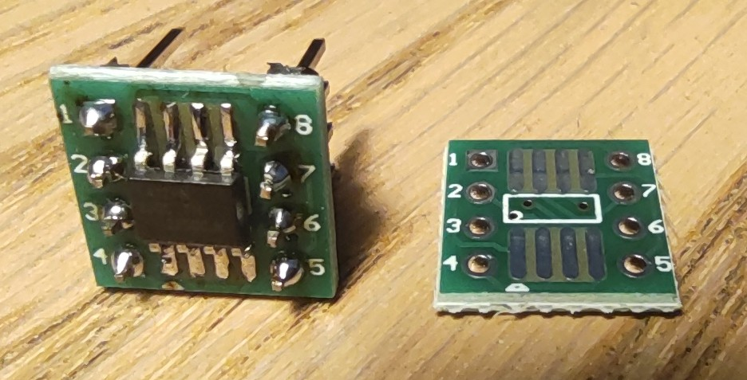

# Programing ATtiny412
## Hardware
ATtiny412 use completly different (UDPI) programing interface than older type of AVR microcontroller. You can program UDPI You will need some UART interface - preferably USB-Uart. I use a Waveshare 21443 with USB-C and changable power (3V3 or 5V), but any other shall work. Additionaly You will need a 1kohm resistor (1/8 watt well be ok, but of course You can use bigger one).
  
Real connection on bredboard  might look like below. ATtiny412 (and other uc in this series) don't have a convinient Dip package, so SOP8 to Dip8 adapter was used.  

If You're not afraid of soldering, some smaller SOP to dip adapter is also available:

## Software
### Toolchain
You need gcc-avr. It is very popular, probably Your's distro have one, however gcc from microchip might help avoid some strange problems.  
You need "AVR 8-Bit Toolchain (Linux)" from [here](https://www.microchip.com/en-us/tools-resources/develop/microchip-studio/gcc-compilers).  
Unpack it somhere - in our examples /opt/avr, but it might be somewhere in /home if You like.
```console
sudo tar -xvzf avr8-gnu-toolchain-xxxx.tar.gz
```
For some reasons, "newer" (about 10 years?) microcontrollers needs additionally atpack, with many data about them.  
For ATtiny412 You need  "Atmel ATtiny Series Device Support" from [here](http://packs.download.atmel.com/).
Unpack it somewhere (/opt/avr in our examples).
For simplify copy some files from pack to gcc toolchain:
```
sudo cp /opt/avr/Atmel.ATtiny_DFP.2.0.368.atpack_FILES/include/avr/iotn?*1[2467].h /opt/avr/avr8-gnu-toolchain-linux_x86_64/avr/include/avr/
```
```console
sudo cp /opt/avr/Atmel.ATtiny_DFP.2.0.368.atpack_FILES/gcc/dev/attiny?*1[2467]/avrxmega3/**.{o,a} /opt/avr/avr8-gnu-toolchain-linux_x86_64/avr/lib/avrxmega3/
```
```console
sudo cp opt/avr/Atmel.ATtiny_DFP.2.0.368.atpack_FILES/gcc/dev/attiny?*1[2467]/avrxmega3/short-calls/*.{o,a} /opt/avr/avr8-gnu-toolchain-linux_x86_64/avr/lib/avrxmega3/short-calls/
```
for /opt/avr/avr8-gnu-toolchain-linux_x86_64/avr/include/avr/io.h add those lines:
```c
# added manualy
#elif defined (__AVR_ATtiny212__)
#  include <avr/iotn212.h>
#elif defined (__AVR_ATtiny412__)
#  include <avr/iotn412.h>
#elif defined (__AVR_ATtiny214__)
#  include <avr/iotn214.h>
#elif defined (__AVR_ATtiny414__)
#  include <avr/iotn414.h>
#elif defined (__AVR_ATtiny814__)
#  include <avr/iotn814.h>
#elif defined (__AVR_ATtiny1614__)
#  include <avr/iotn1614.h>
#elif defined (__AVR_ATtiny3214__)
#  include <avr/iotn3214.h>
#elif defined (__AVR_ATtiny416__)
#  include <avr/iotn416.h>
#elif defined (__AVR_ATtiny816__)
#  include <avr/iotn816.h>
#elif defined (__AVR_ATtiny1616__)
#  include <avr/iotn1616.h>
#elif defined (__AVR_ATtiny3216__)
#  include <avr/iotn3216.h>
#elif defined (__AVR_ATtiny417__)
#  include <avr/iotn417.h>
#elif defined (__AVR_ATtiny817__)
#  include <avr/iotn817.h>
#elif defined (__AVR_ATtiny1617__)
#  include <avr/iotn1617.h>
#elif defined (__AVR_ATtiny3217__)
#  include <avr/iotn3217.h>
```
Many thanks for [Tycho](https://github.com/TychoJ/avrMake) and [LeoNerd](http://leonerds-code.blogspot.com/2019/06/building-for-new-attiny-1-series-chips.html).

### Programmer
#### Linux
install pymcuprog, preferably in venv enviroment.
check dmesg for info about addresses
```console
sudo dmesg
```
something like below shall be found
```console
[52572.355445] usb 1-1: new full-speed USB device number 21 using xhci_hcd
[52572.505488] usb 1-1: New USB device found, idVendor=1a86, idProduct=55d3, bcdDevice= 4.43
[52572.505503] usb 1-1: New USB device strings: Mfr=0, Product=2, SerialNumber=3
[52572.505509] usb 1-1: Product: USB Single Serial
[52572.505514] usb 1-1: SerialNumber: 5434037781
[52572.571752] cdc_acm 1-1:1.0: ttyACM0: USB ACM device
[52572.571793] usbcore: registered new interface driver cdc_acm
[52572.571796] cdc_acm: USB Abstract Control Model driver for USB modems and ISDN adapters
```
which mean that addres is **ttyACM0**

to check connection type (wiht correct uart address):
```console
pymcuprog ping -t uart -u /dev/ttyACM0 -d attiny412
```

proper answer will be similar to:
```console
Connecting to SerialUPDI
Pinging device...
Ping response: 1E9223
Done.
```
If You see something similar You are ready to go.

To erase memory and send program to microcontroller You can use:
```console
pymcuprog erase -t uart -u /dev/ttyACM0 -d attiny412
pymcuprog write -f program.hex -t uart -u /dev/ttyACM0 -d attiny412
```

Getting .hex file from source code and sending it to microcontroller is automated in makefile.


## Makefile
rest of the programming process is automated using Makefiles (TODO: link)


